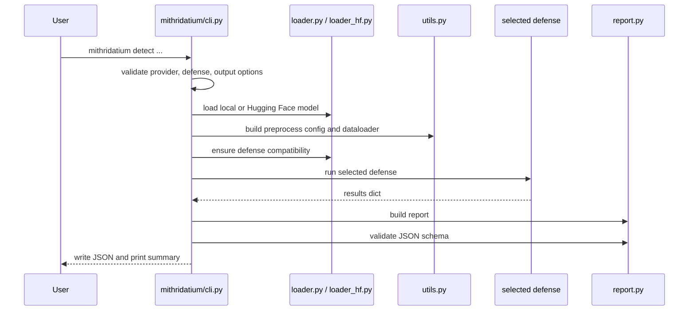

# CLI Flow

The main user entry point is:

```bash
mithridatium detect --model models/resnet18_poison.pth --data cifar10 --defense mmbd --out reports/mmbd.json
```

The command is implemented in `mithridatium/cli.py`.

## Basic CLI Commands

```bash
mithridatium --version
mithridatium --help
mithridatium detect --help
mithridatium defenses
```

## Flow



## Supported Providers

| Provider | CLI options | Notes |
| --- | --- | --- |
| `torchvision` | `--model`, `--arch` | Loads a local `.pt` or `.pth` checkpoint. |
| `huggingface` | `--provider huggingface`, `--hf-model-id` | Loads an image-classification repo through `AutoModelForImageClassification`. |

## Supported Defenses

Use `mithridatium defenses` to list supported defenses.

```bash
mithridatium defenses
```

The current defense set is `aeva`, `freeeagle`, `mmbd`, and `strip`.

## Exit Codes

| Code | Meaning |
| --- | --- |
| 64 | Invalid CLI usage, such as an unsupported defense or incompatible defense/model pair |
| 66 | Local model path missing or not a file |
| 73 | Output file already exists and `--force` was not supplied |
| 74 | Load, execution, report validation, or I/O failure |

## Output Behavior

By default, `mithridatium detect` writes JSON to `reports/report.json`. Use `--out -` to write JSON to stdout, or `--force` to overwrite an existing report file.

```bash
mithridatium detect \
  --model models/resnet18_clean.pth \
  --defense freeeagle \
  --data cifar10 \
  --out - \
  | python -m json.tool
```

When running from inside the package folder, adjust paths back to the repository root:

```bash
cd mithridatium
mithridatium detect \
  --model ../models/resnet18_clean.pth \
  --defense freeeagle \
  --data cifar10 \
  --out ../reports/freeeagle.json \
  --force
```

## Troubleshooting

- `model path not found or not a file`: check the current working directory and use `../` paths if you are inside `mithridatium/`.
- `output file already exists`: add `--force` or choose a new `--out` path.
- `unsupported --defense`: run `mithridatium defenses` and choose one of the listed defenses.
- Hugging Face load failures usually mean the repo is not compatible with `AutoModelForImageClassification` or its preprocessing is not supported by the current wrapper.

## Notes for Contributors

- Keep `DEFENSES` in `mithridatium/cli.py` aligned with defense docs.
- When adding CLI flags, update the relevant defense page and [sample commands](../testing/sample-commands.md).
- The CLI validates generated reports against `reports/report_schema.json`; update the schema when adding new required report fields.
