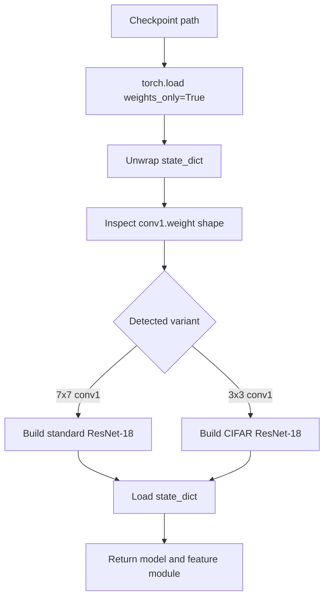

# Model Loading

Mithridatium has two model-loading paths: local torchvision-style checkpoints and Hugging Face image-classification models.

## Local Checkpoints

Local checkpoint loading lives in `mithridatium/loader.py`.



The loader currently supports:

- `resnet18`
- `resnet18_cifar`
- `resnet34`
- `hf_resnet50` as a helper path

The CLI uses `detect_and_build()` for local checkpoints. It inspects the checkpoint and builds a compatible ResNet variant before loading weights.

## Hugging Face Models

Hugging Face loading lives in `mithridatium/loader_hf.py`.

The wrapper:

- Calls `AutoModelForImageClassification.from_pretrained(model_id)`.
- Calls `AutoImageProcessor.from_pretrained(model_id)`.
- Exposes `forward(x) -> logits`.
- Reads processor mean, standard deviation, and size metadata when available.
- Reports `num_classes` from `model.config.num_labels`.

Example:

```bash
mithridatium detect \
  --provider huggingface \
  --hf-model-id microsoft/resnet-50 \
  --data cifar10_for_imagenet \
  --defense strip \
  --out reports/hf_strip.json \
  --force
```

## Compatibility Rules

| Defense | Local checkpoints | Hugging Face models | Why |
| --- | --- | --- | --- |
| FreeEagle | ResNet-family only | Not currently supported by wrapper | Needs internal ResNet stage access |
| STRIP | Supported when forward pass and data work | Supported for compatible image classifiers | Uses logits from perturbed inputs |
| MMBD | Supported when gradients and logits work | May work for compatible image classifiers | Optimizes synthetic inputs against logits |
| AEVA | Supported when data and logits work | May work but can be expensive | Uses repeated model queries and clean samples |

## Preprocessing Risks

Hugging Face support may depend on architecture compatibility and preprocessing. The wrapper tries to align image size and normalization with the model processor, but the selected `--data` still matters because it controls the dataset source and labels.

Dataset mismatch can cause misleading results. For example, using CIFAR-10 labels and images with an ImageNet classifier can make accuracy and entropy hard to interpret unless the model and dataset pairing is intentional.
