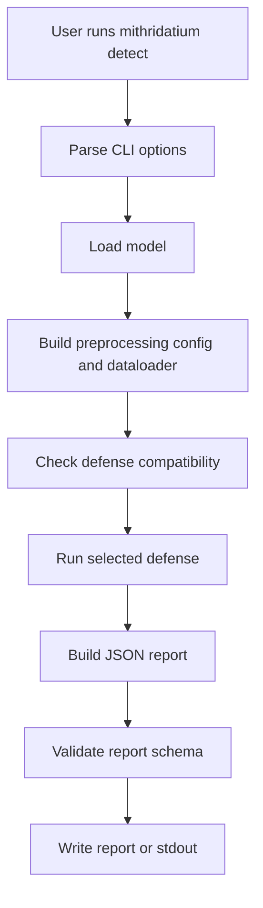

# Architecture Overview

Mithridatium is a Python package and CLI for running backdoor-detection defenses against image classification models. The current CLI runs one selected defense per command.

## Main Components

| Area | Important files | Purpose |
| --- | --- | --- |
| CLI | `mithridatium/cli.py` | Typer commands, options, defense dispatch, report writing |
| Model loading | `mithridatium/loader.py`, `mithridatium/loader_hf.py` | Local checkpoint loading and Hugging Face model wrapping |
| Preprocessing | `mithridatium/utils.py` | Dataset configs, dataloaders, normalization, image sizes |
| Defenses | `mithridatium/defenses/` | FreeEagle, STRIP, MMBD, and AEVA implementations |
| Reporting | `mithridatium/report.py`, `reports/report_schema.json` | Report payloads, summaries, JSON schema validation |
| UI/service | `mithridatium/gradio_app.py`, `mithridatium/service.py` | Gradio and service-oriented wrappers |
| Tests | `tests/` | Unit and integration tests for loaders, reports, attacks, and defenses |

## Current Detection Model

The CLI supports these defenses individually:

- `freeeagle`
- `strip`
- `mmbd`
- `aeva`

The current system does not combine all defenses in one command. Users choose one defense with `--defense`.

## Important Design Notes

- Local models are expected to be PyTorch `.pt` or `.pth` checkpoints.
- Local ResNet checkpoints are auto-detected as standard ResNet-18 or CIFAR-style ResNet-18 based on `conv1.weight`.
- Hugging Face support wraps `AutoModelForImageClassification` models as plain PyTorch classifiers.
- Hugging Face compatibility depends on model architecture, processor metadata, and preprocessing alignment.
- FreeEagle is white-box and currently ResNet-family only.
- STRIP and AEVA need representative input data.
- Dataset mismatch can change the behavior of data-dependent defenses.

## Related Docs

- [CLI flow](cli-flow.md)
- [Model loading](model-loading.md)
- [Reporting pipeline](reporting-pipeline.md)
- [Defenses overview](../defenses/overview.md)
