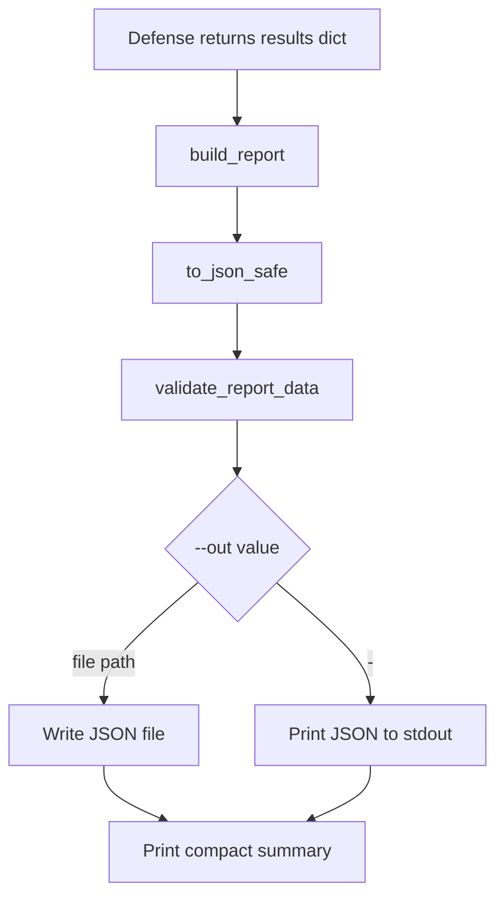

# Reporting Pipeline

Reports are generated in `mithridatium/report.py` and validated against `reports/report_schema.json`.

## Report Flow

## Top-Level Report Fields

| Field | Meaning |
| --- | --- |
| `mithridatium_version` | Package version from installed metadata or fallback |
| `timestamp_utc` | UTC report creation time |
| `model_path` | Local checkpoint path or Hugging Face model ID |
| `defense` | Selected defense |
| `dataset` | Dataset name passed to the CLI |
| `results` | Defense-specific output |

## Defense Results

Each defense returns its own result payload. Common fields include:

- `defense`
- `dataset`
- `verdict`
- `thresholds`
- `parameters`

See the defense docs for defense-specific fields:

- [FreeEagle](../defenses/freeeagle.md)
- [STRIP](../defenses/strip.md)
- [MMBD](../defenses/mmbd.md)
- [AEVA](../defenses/aeva.md)

## Contributor Notes

- Keep report fields JSON-serializable. `to_json_safe()` converts NumPy arrays and NumPy scalar types.
- If a defense adds new required output fields, update `reports/report_schema.json` and tests.
- `render_summary()` currently has explicit summaries for MMBD, STRIP, and FreeEagle, with fallback behavior for other outputs.
