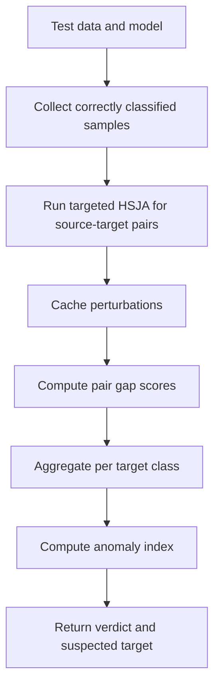

# AEVA

AEVA is a black-box-style defense that uses input perturbations and model queries to look for asymmetric decision-boundary behavior. It does not need model internals, but it can be slow.

## What It Does

AEVA collects correctly classified samples, runs a targeted decision-boundary attack across source-target class pairs, and measures whether one target class is unusually easy to reach with concentrated perturbations.



## Access Needed

- Model queries that return logits/predictions.
- Representative labeled input data.
- No internal layers are required.

## Inputs

- A compatible local or Hugging Face image classifier.
- Dataset/preprocessing selection.
- Query-budget options such as samples per class and HSJA iterations.

## Outputs

Important `results` fields:

| Field | Meaning |
| --- | --- |
| `clean_accuracy` | Accuracy on the collected validation/test data |
| `suspicion_score` | Maximum anomaly index |
| `suspected_target` | Target class if threshold is exceeded, otherwise `null` |
| `global_adversarial_peak` | Aggregated score per target class |
| `anomaly_index` | MAD-normalized target-class anomaly scores |
| `pair_gap_scores` | Source-target matrix of perturbation concentration scores |
| `source_target_mean_l2` | Source-target matrix of perturbation distances |
| `output_dir` | Cache directory for perturbation files |

## Example CLI Command

Start with a small smoke test:

```bash
mithridatium detect \
  --model models/resnet18_poison.pth \
  --data cifar10 \
  --defense aeva \
  --aeva-samples-per-class 5 \
  --aeva-hsja-iterations 5 \
  --aeva-ep 1 \
  --out reports/aeva_smoke.json \
  --force
```

Larger runs can increase `--aeva-ep`, `--aeva-samples-per-class`, and HSJA budgets.

## Useful Options

| Flag | Current CLI default | Notes |
| --- | --- | --- |
| `--aeva-samples-per-class` | `10` | Number of correctly classified samples per class |
| `--aeva-hsja-iterations` | `10` | HSJA iterations |
| `--aeva-hsja-max-num-evals` | `2000` | Query budget per gradient approximation |
| `--aeva-hsja-init-num-evals` | `50` | Initial query count |
| `--aeva-hsja-query-batch-size` | `256` | Query batch size |
| `--aeva-anomaly-index-threshold` | `4.0` | Suspicion threshold |
| `--aeva-sp` | `0` | Start source class index |
| `--aeva-ep` | `1` | Exclusive end source class index |
| `--aeva-verbose` | `false` | Print HSJA details |

## Strengths

- Uses model queries and input perturbations rather than internal layers.
- Can identify a suspected target class.
- Caches perturbation files so repeated runs can reuse work.
- Provides detailed source-target matrices for investigation.

## Limitations

- Computationally expensive; runtime grows with source-target pairs and query budget.
- Requires correctly classified samples, so low clean accuracy can make results unreliable or fail.
- Requires representative labeled data and compatible preprocessing.
- Dataset mismatch can distort both accuracy and perturbation behavior.
- Does not recover the trigger pattern.

## Supported Datasets

The current implementation allows `cifar10`, `cifar100`, `cifar10_for_imagenet`, `imagenet`, and `imagenet_subset`. Practical reliability still depends on matching the model, label space, and preprocessing.

## Interpretation

- `suspicion_score >= anomaly_index_threshold` means `likely backdoored`.
- `suspected_target` is populated only when the threshold is exceeded.
- A column-wide spike in `pair_gap_scores` or `global_adversarial_peak` suggests one target class is unusually reachable from many sources.

## Graphs


## Related Docs

- [Hugging Face model testing](../testing/huggingface-model-testing.md)
- [Known issues](../handoff/known-issues.md)
