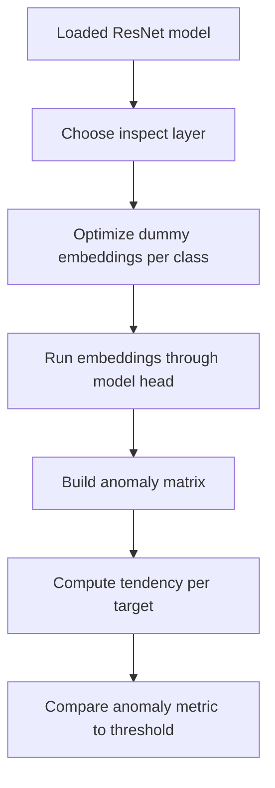
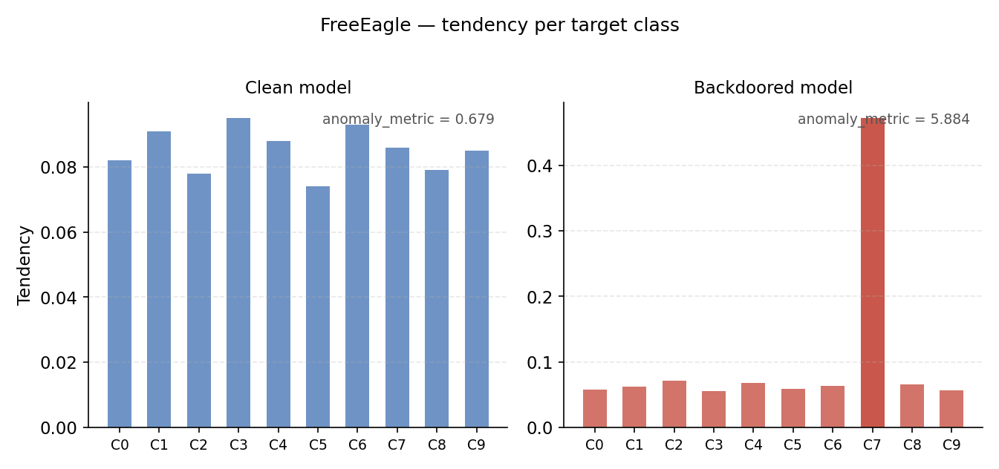

# FreeEagle

FreeEagle is a white-box, data-free defense. It inspects internal model behavior in embedding space instead of adding triggers to images or querying a dataset.

## What It Does

FreeEagle splits a compatible ResNet at an internal stage, optimizes dummy embeddings for each target class, then checks whether one class attracts an abnormal amount of softmax mass from the others. A strong single-class outlier is treated as suspicious.



## Access Needed

- White-box model access.
- Internal ResNet layers and classification head.
- No input dataset.

## Inputs

- A compatible local ResNet-family checkpoint.
- A preprocessing config for input shape and class count.
- Optional FreeEagle CLI tuning flags.

## Outputs

Important `results` fields:

| Field | Meaning |
| --- | --- |
| `anomaly_metric` | IQR-style outlier score over class tendency values |
| `tendency_per_target` | Per-target-class routing tendency |
| `anomaly_matrix` | Class-by-class softmax score matrix |
| `verdict` | `likely clean` or `likely backdoored` |
| `thresholds.anomaly_metric_threshold` | Decision threshold, default `2.0` |
| `parameters` | Optimization and inspect-layer settings |

## Example CLI Command

```bash
mithridatium detect \
  --model models/resnet18_poison.pth \
  --data cifar10 \
  --defense freeeagle \
  --freeeagle-optimize-steps 100 \
  --freeeagle-anomaly-threshold 2.0 \
  --out reports/freeeagle.json \
  --force
```

## Useful Options

| Flag | Default | Notes |
| --- | --- | --- |
| `--freeeagle-num-classes` | `0` | Use `0` to infer from model head |
| `--freeeagle-optimize-steps` | `300` | More steps can improve sensitivity but take longer |
| `--freeeagle-anomaly-threshold` | `2.0` | Higher values reduce sensitivity |
| `--freeeagle-inspect-layer-position` | `2` | ResNet stage index from `0` to `4` |
| `--freeeagle-use-transpose-correction` | `false` | Optional symmetric correction |

## Strengths

- Does not require a dataset.
- Directly inspects internal model behavior.
- Produces detailed diagnostic arrays beyond a single verdict.
- Useful when representative data is unavailable.

## Limitations

- Currently supports known ResNet-family models in Mithridatium.
- Not currently compatible with the Hugging Face wrapper because stable internal feature extraction is not exposed.
- Does not recover the trigger pattern.
- Does not automatically label the suspected target class, though `tendency_per_target` can suggest one.
- Results can vary with optimization settings and inspect-layer choice.

## Interpretation

- `anomaly_metric >= threshold` means `likely backdoored`.
- A clear spike in `tendency_per_target` suggests a possible target class.
- Flat tendency values suggest no dominant target-class routing anomaly.

## Graph



## Related Docs

- [FreeEagle testing](../testing/freeeagle-testing.md)
- [Model loading](../architecture/model-loading.md)
