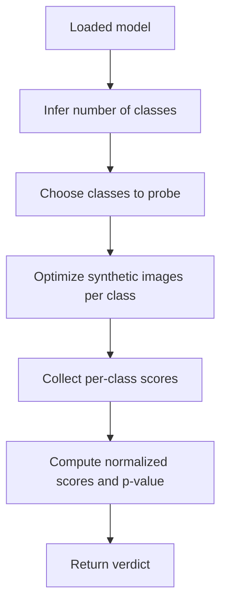

# MMBD

MMBD looks for abnormal class dominance or suspicious scoring behavior by optimizing synthetic inputs toward target classes and comparing class-wise scores.

## What It Does

The implementation creates random synthetic images for a subset of classes, optimizes them to maximize each target class response, then checks whether one class has an unusually dominant score. It reports raw per-class scores, MAD-normalized scores, and a gamma-distribution p-value.



## Access Needed

- Model logits.
- Gradients with respect to synthetic inputs.
- No real dataset is required, but a preprocessing config is used for input shape and normalization.

## Inputs

- A compatible local or Hugging Face image classifier.
- Dataset/preprocessing selection.
- Model output class count must be inferable.

## Outputs

Important `results` fields:

| Field | Meaning |
| --- | --- |
| `per_class_scores` | Raw optimized scores for probed classes |
| `normalized_scores` | MAD-normalized deviation scores |
| `p_value` | Statistical anomaly score |
| `top_eigenvalue` | Maximum class score alias used by existing schema/reporting |
| `verdict` | `Likely clean` or `Likely backdoored` |
| `thresholds` | p-value and normalized-score interpretation bands |

## Example CLI Command

```bash
mithridatium detect \
  --model models/resnet18_poison.pth \
  --data cifar10 \
  --defense mmbd \
  --out reports/mmbd.json \
  --force
```

Hugging Face example:

```bash
mithridatium detect \
  --provider huggingface \
  --hf-model-id microsoft/resnet-50 \
  --data cifar10_for_imagenet \
  --defense mmbd \
  --out reports/hf_mmbd.json \
  --force
```

## Current Internal Defaults

These settings are currently internal to `mithridatium/defenses/mmbd.py` rather than CLI flags:

| Setting | Current value |
| --- | --- |
| `NSTEP` | `75` |
| `N_CLASSES_TO_PROBE` | `min(5, NC)` |
| `NUM_IMAGES` | `30` |
| optimizer | `SGD(lr=1e-2, momentum=0.9)` |
| p-value threshold | `0.05` |

## Strengths

- Does not require a real dataset.
- Looks for class dominance directly in model scoring behavior.
- Produces both raw scores and normalized scores.
- Can run on non-ResNet models if logits and gradients behave as expected.

## Limitations

- Probes only a subset of classes by default, so it can miss a target outside that subset.
- More computationally expensive than simple forward-pass methods.
- Requires gradients and a compatible PyTorch model path.
- The statistical fit can be unreliable with very few probed classes or unusual score distributions.
- Does not recover the trigger pattern.

## Interpretation

- `p_value < 0.05` means `Likely backdoored`.
- A `normalized_scores` value above `5.0` is very suspicious.
- A single dominant `per_class_scores` value is the main pattern to investigate.

## Graphs


## Related Docs

- [Testing overview](../testing/overview.md)
- [Reporting pipeline](../architecture/reporting-pipeline.md)
