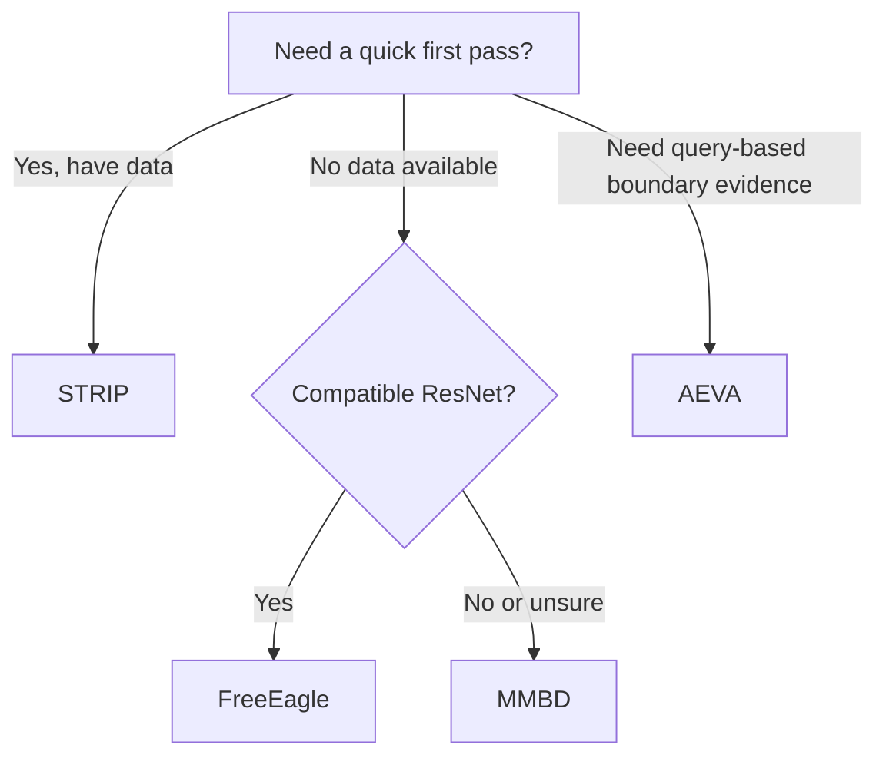

# Defenses Overview

Mithridatium provides four backdoor-detection defenses for pretrained image classifiers. The CLI runs one selected defense per `mithridatium detect` command.

## Quick Reference

| Defense | Style | Signal | Dataset required | Current compatibility | Primary output |
| --- | --- | --- | --- | --- | --- |
| [FreeEagle](freeeagle.md) | White-box, data-free | Internal embedding routing anomaly | No | ResNet-family local models | `anomaly_metric` |
| [STRIP](strip.md) | Black-box style | Entropy under mixed/superimposed inputs | Yes | Any compatible logits model | entropy statistics and threshold details |
| [MMBD](mmbd.md) | White-box/optimization-based | Abnormal class dominance or suspicious scoring behavior | No | Any compatible logits/gradient model | `p_value`, `normalized_scores` |
| [AEVA](aeva.md) | Black-box style | Query-based perturbation and decision-boundary asymmetry | Yes | Any compatible logits model, but expensive | `suspicion_score`, `suspected_target` |

## Choosing a Defense

Start with STRIP when you have representative input data and want a fast query-only signal. Be careful with dataset mismatch because STRIP depends on the selected dataset and preprocessing.

Use FreeEagle when you have a compatible ResNet model and want a white-box, data-free defense. FreeEagle analyzes internal model behavior; it does not add triggers to images.

Use MMBD when you want a data-free optimization-based signal that looks for abnormal class dominance. Remember that the current implementation probes only a subset of classes by default.

Use AEVA when you want a black-box-style, query-based decision-boundary signal and can afford a slower run. Start with small CLI settings for smoke tests.

## Shared CLI Pattern

```bash
mithridatium detect \
  --model models/resnet18_poison.pth \
  --data cifar10 \
  --defense mmbd \
  --out reports/mmbd.json \
  --force
```

Hugging Face example:

```bash
mithridatium detect \
  --provider huggingface \
  --hf-model-id microsoft/resnet-50 \
  --data cifar10_for_imagenet \
  --defense strip \
  --out reports/hf_strip.json \
  --force
```

## Defense Selection Flow



## Common Cautions

- Do not compare scores across unrelated datasets without calibration.
- Dataset mismatch can produce confusing entropy, accuracy, or perturbation behavior.
- Hugging Face model support depends on architecture compatibility and preprocessing metadata.
- A verdict is a detection signal, not a complete forensic explanation.
- Benchmark clean and backdoored models are important for interpreting thresholds.

## Exit Codes

| Code | Meaning |
| --- | --- |
| 64 | Invalid CLI usage or incompatible defense/model pair |
| 66 | Local model path missing or not a file |
| 73 | Output file exists and `--force` not supplied |
| 74 | Load, execution, report validation, or I/O failure |
