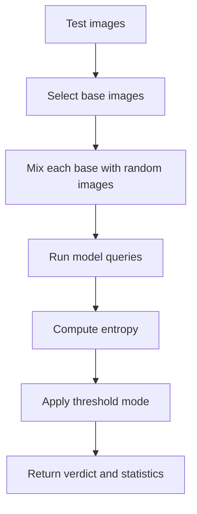

# STRIP

STRIP is a black-box-style defense that perturbs inputs by mixing or superimposing images, then checks how stable the model's predictions are under those perturbations.

## What It Does

For each base image, STRIP mixes the image with randomly selected images, runs the model on the mixed inputs, and computes prediction entropy from the logits. The current implementation supports a dynamic MAD-based threshold mode and a static mean-entropy mode.



## Access Needed

- Model query access that returns logits.
- Representative input data.
- No internal layers are required.

## Inputs

- A compatible local or Hugging Face image classifier.
- A dataset/preprocessing choice such as `cifar10` or `cifar10_for_imagenet`.
- Optional threshold options.

## Outputs

Important `results` fields:

| Field | Meaning |
| --- | --- |
| `entropies` | Mean entropy per base sample |
| `statistics.entropy_mean` | Average entropy across base samples |
| `statistics.entropy_std` | Entropy spread across base samples |
| `thresholds` | Dynamic or static threshold details |
| `verdict` | `likely clean` or `likely backdoored` |
| `parameters` | Number of base samples, perturbations, and threshold settings |

## Example CLI Command

```bash
mithridatium detect \
  --model models/resnet18_poison.pth \
  --data cifar10 \
  --defense strip \
  --out reports/strip.json \
  --force
```

Hugging Face example:

```bash
mithridatium detect \
  --provider huggingface \
  --hf-model-id microsoft/resnet-50 \
  --data cifar10_for_imagenet \
  --defense strip \
  --out reports/hf_strip.json \
  --force
```

## Useful Options

| Flag | Default | Notes |
| --- | --- | --- |
| `--strip-threshold-mode` | `dynamic_mad` | Use `dynamic_mad` or `static_mean` |
| `--strip-entropy-mean-threshold` | `None` | Required for explicit static thresholding |
| `--strip-mad-scale` | `2.5` | MAD multiplier for dynamic low-entropy threshold |
| `--strip-suspicious-fraction-threshold` | `0.20` | Fraction of suspicious samples needed to flag |

## Strengths

- Fast compared with optimization-heavy defenses.
- Works through forward passes and logits.
- Can run on compatible Hugging Face image classifiers.
- Useful as a first-pass screen when representative data is available.

## Limitations

- Requires representative input data.
- Dataset mismatch can strongly affect entropy and verdicts.
- Thresholds may need calibration for each dataset and architecture.
- Does not identify the trigger pattern or target class.
- Random sampling can produce run-to-run variation unless a seed is set through Python usage.

## Interpretation

Look at both the verdict and the threshold details:

- In `dynamic_mad` mode, inspect `thresholds.suspicious_fraction`, normalized entropy values, and which dynamic rule triggered.
- In `static_mean` mode, compare `statistics.entropy_mean` to `thresholds.entropy_mean_threshold`.
- High variance, unusual low-entropy tails, or near-flat high-entropy behavior can be suspicious depending on the selected mode.

## Graphs


## Related Docs

- [Testing overview](../testing/overview.md)
- [Hugging Face model testing](../testing/huggingface-model-testing.md)
