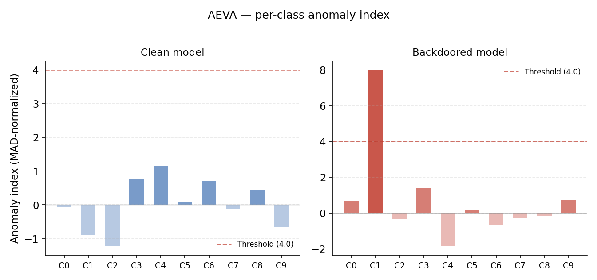
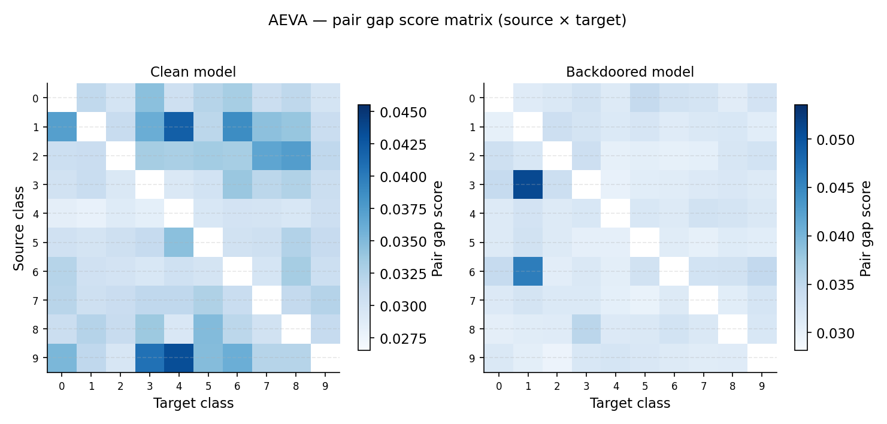

# AEVA Defense — Mithridatium

## Overview

AEVA (Adversarial Example-based Vulnerability Analysis) detects backdoors by measuring how difficult it is to craft adversarial examples that transfer between classes. In a backdoored model, images from any source class can be easily pushed toward the target class with anomalously small perturbations, producing an elevated adversarial peak for that class. AEVA uses a black-box decision-boundary attack (HSJA) to estimate this per-class vulnerability without requiring model gradients.

## Method

For each source-target class pair, AEVA:

1. Collects correctly classified samples for both the source and target class.
2. Runs a targeted HSJA (Hopfield Sign Jump Attack) to find the minimum L2 perturbation that causes a source-class image to be classified as the target class.
3. Computes a pair-gap score: the ratio of the top-2 channel line sums to the total perturbation mass. A high ratio means perturbation energy is concentrated in a small number of directions, which is characteristic of backdoor-aligned decision boundaries.
4. Aggregates pair-gap scores column-wise (summing over all sources per target) to get the global adversarial peak per target class.
5. Computes a MAD-normalized anomaly index for each class:

   ```
   anomaly_index[c] = (gap[c] - median(gap)) / (1.4826 * MAD(gap))
   ```

6. The class with the maximum anomaly index is flagged as the suspected target if its score exceeds the threshold.

## Key Outputs

| Field                     | Description                                                      |
| ------------------------- | ---------------------------------------------------------------- |
| `global_adversarial_peak` | Aggregated pair-gap score per target class                       |
| `anomaly_index`           | MAD-normalized deviation for each class                          |
| `suspicion_score`         | Maximum anomaly index value                                      |
| `suspected_target`        | Class index flagged as suspected backdoor target (null if clean) |
| `pair_gap_scores`         | 10×10 matrix of raw pair-gap scores (source × target)            |
| `source_target_mean_l2`   | 10×10 matrix of mean L2 distances per source-target pair         |
| `clean_accuracy`          | Model accuracy on the clean test set                             |
| `verdict`                 | `"likely clean"` or `"likely backdoored"`                        |

## CLI Usage

Base command:

```bash
mithridatium detect \
  --model models/resnet18.pth \
  --data cifar10 \
  --defense aeva \
  --out reports/aeva.json
```

AEVA does not expose tunable parameters via the CLI. The CLI invokes:

```python
results = run_aeva(model, config, task=data, device=device, model_path=model_path)
```

## CLI Parameters

| Flag             | Description                                                    |
| ---------------- | -------------------------------------------------------------- |
| `--model, -m`    | Path to model checkpoint (.pth)                                |
| `--provider, -p` | `torchvision` or `huggingface`                                 |
| `--hf-model-id`  | Hugging Face model ID (required when `--provider huggingface`) |
| `--data, -d`     | Dataset name (`cifar10` or `cifar100`)                         |
| `--defense, -D`  | Must be `aeva`                                                 |
| `--arch, -a`     | Architecture hint (used for model validation)                  |
| `--out, -o`      | Output JSON path; use `-` for stdout                           |
| `--force, -f`    | Overwrite existing output file                                 |

Internal defaults (not CLI-tunable):

```
samples_per_class       = 40
hsja_iterations         = 50
hsja_max_num_evals      = 30,000
hsja_init_num_evals     = 100
hsja_query_batch_size   = 512
anomaly_index_threshold = 4.0
constraint              = l2
```

**Supported datasets:** `cifar10`, `cifar100` only. Passing any other dataset raises a `ValueError` at runtime.

## Caching

AEVA caches adversarial perturbations to disk in a per-model namespace under `{task}_adv_per/{model_stem}-{hash}/`. The namespace is derived from the model path, file size, and modification time. If the same model is run again with the same parameters, cached perturbation files are reused, which significantly reduces runtime on repeated runs.

The cache directory is reported in the output under `output_dir`.

## Python Usage

```python
from mithridatium.defenses.aeva import run_aeva
from mithridatium import utils

model = ...
config = utils.get_preprocess_config("cifar10")

results = run_aeva(
    model,
    config,
    task="cifar10",
    model_path="models/resnet18.pth",   # used for cache namespace
    samples_per_class=40,
    hsja_iterations=50,
    anomaly_index_threshold=4.0,
)
```

## Output Format

```json
{
  "defense": "aeva",
  "dataset": "cifar10",
  "clean_accuracy": float,
  "verdict": "likely clean | likely backdoored",
  "suspected_backdoor": bool,
  "num_flagged": int,
  "suspected_target": int | null,
  "suspicion_score": float,
  "top_eigenvalue": float,
  "global_adversarial_peak": [float, ...],
  "anomaly_index": [float, ...],
  "pair_gap_scores": [[float | null, ...], ...],
  "source_target_mean_l2": [[float | null, ...], ...],
  "thresholds": { "anomaly_index_threshold": float },
  "parameters": { ... },
  "output_dir": "string"
}
```

Note: `top_eigenvalue` is an alias for `suspicion_score` kept for schema compatibility. Diagonal entries in `pair_gap_scores` and `source_target_mean_l2` are `null` (source == target is undefined).

## Interpretation

- A large spike in `anomaly_index` for a single class is a strong backdoor indicator. The spike indicates that images from all source classes can be pushed toward that target with unusually concentrated perturbations.
- `suspicion_score >= 4.0` triggers a positive verdict.
- `global_adversarial_peak` values should be broadly similar across classes in a clean model. A single outlier warrants inspection.
- `source_target_mean_l2` provides complementary evidence: unusually low mean L2 distance to a particular target class (across all sources) suggests reduced decision-boundary resistance.

## Example Results

Clean model (`resnet18_cifar10.pt`):

```
clean_accuracy:   29.84%   (low — model may be undertrained)
suspicion_score:  1.160    → below threshold 4.0
suspected_target: null
verdict:          likely clean
```

Backdoored model (`resnet18_poison.pt`):

```
clean_accuracy:   81.84%
suspicion_score:  7.987    → well above threshold 4.0
suspected_target: class 1
anomaly_index[1]: 7.987    → dominant outlier
verdict:          likely backdoored
```

## Limitations

- **Supported datasets:** `cifar10` and `cifar100` only. Other datasets raise a `ValueError`.
- **Computationally intensive.** Each source-target pair requires running HSJA, which performs up to `hsja_max_num_evals` model queries per iteration over `hsja_iterations` iterations. Runtime scales as O(num_classes²).
- The clean model in the example reports low accuracy (29.84%), which indicates it may be undertrained. AEVA still produces a valid verdict in this case, but anomaly index values may be less reliable on very weak models.
- Caching helps on repeated runs, but the initial run on a 10-class dataset is slow without a GPU.
- AEVA does not identify the trigger pattern or attack type — only the suspected target class.

## Summary

AEVA detects backdoors by identifying asymmetric vulnerability in the model's decision boundaries using a black-box adversarial attack. A backdoored class shows anomalously small, concentrated perturbations from all other classes, producing a statistically significant spike in the per-class anomaly index. It is the most computationally intensive defense in Mithridatium and is best run with GPU access.

## Graphs

**Per-class anomaly index** — MAD-normalized deviation for each class, clean vs backdoored side by side, with the detection threshold marked. A clean model has no class significantly above zero; the backdoored model shows a sharp spike at the target class (class 1, score 7.99).



**Pair gap score matrix** — heatmap of raw pair-gap scores across all source-target class combinations. An elevated column at the backdoor target class indicates that images from all source classes can be pushed toward that target with anomalously concentrated perturbations.


