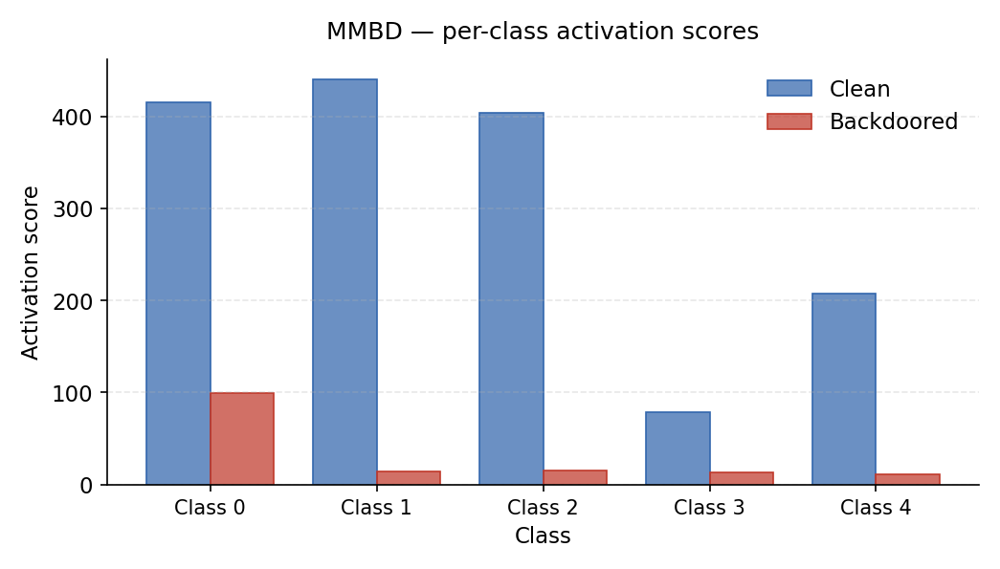
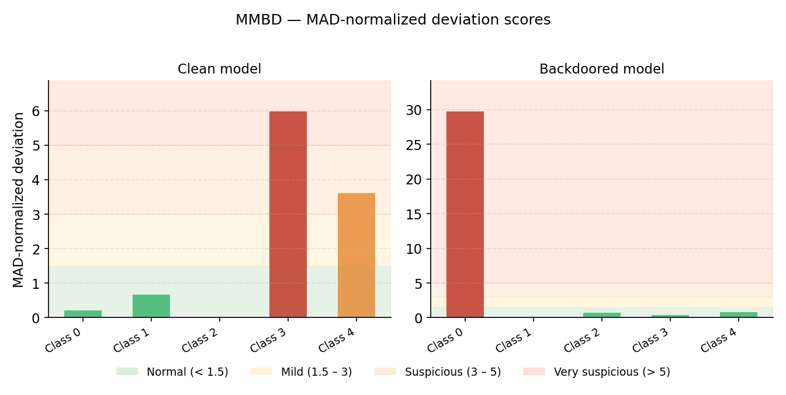

# MMBD Defense — Mithridatium

## Overview

MMBD (Multi-Model Backdoor Detection) identifies backdoors by optimizing synthetic inputs toward each target class and measuring abnormal activation behavior. Backdoored models tend to produce an unusually dominant response for one specific class compared to all others.

## Method

MMBD performs class-wise optimization:

1. For each target class, initialize random images.
2. Optimize images via SGD to maximize activation for that class while suppressing all others.
3. Record the maximum activation score per class.
4. Compute MAD-normalized deviation scores across classes.
5. Fit a gamma distribution to the non-peak scores and compute a p-value for the maximum.

A backdoored model exhibits a single class with significantly higher activation than the rest, producing a large normalized deviation score and a near-zero p-value.

## Key Outputs

| Field               | Description                                                           |
| ------------------- | --------------------------------------------------------------------- |
| `per_class_scores`  | Maximum activation score per probed class                             |
| `normalized_scores` | Per-class deviation from median, normalized by MAD                    |
| `p_value`           | Statistical significance of the dominant class anomaly                |
| `top_eigenvalue`    | Maximum activation score across all probed classes                    |
| `verdict`           | `"Likely clean"` or `"Likely backdoored"` (threshold: p-value < 0.05) |

Note: `suspected_target` is not included in the current output — it is reserved for a future release.

## Normalized Score Thresholds

| Range     | Interpretation  |
| --------- | --------------- |
| 0.0 – 1.5 | Normal          |
| 1.5 – 3.0 | Mild deviation  |
| 3.0 – 5.0 | Suspicious      |
| > 5.0     | Very suspicious |

## CLI Usage

Base command:

```bash
mithridatium detect \
  --model models/resnet18.pth \
  --data cifar10 \
  --defense mmbd \
  --out reports/mmbd.json
```

Hugging Face provider:

```bash
mithridatium detect \
  --provider huggingface \
  --hf-model-id microsoft/resnet-50 \
  --data cifar10_for_imagenet \
  --defense mmbd \
  --out reports/mmbd.json
```

## CLI Parameters

| Flag             | Description                                                    |
| ---------------- | -------------------------------------------------------------- |
| `--model, -m`    | Path to model checkpoint (.pth)                                |
| `--provider, -p` | `torchvision` or `huggingface`                                 |
| `--hf-model-id`  | Hugging Face model ID (required when `--provider huggingface`) |
| `--data, -d`     | Dataset name (e.g., `cifar10`)                                 |
| `--defense, -D`  | Must be `mmbd`                                                 |
| `--arch, -a`     | Architecture hint (e.g., `resnet18`)                           |
| `--out, -o`      | Output JSON path; use `-` for stdout                           |
| `--force, -f`    | Overwrite existing output file                                 |

MMBD does not expose additional tunable parameters via the CLI. Internal defaults are:

```
NC              = 10    # output classes used in the loss
N_CLASSES_TO_PROBE = 5  # number of classes optimized per run
NSTEP           = 75    # optimization steps per class
NUM_IMAGES      = 30    # synthetic images per class
optimizer       = SGD(lr=1e-2, momentum=0.9)
```

The CLI invokes:

```python
results = run_mmbd(model, config)
```

## Output Format

```json
{
  "defense": "mmbd",
  "per_class_scores": [float, ...],
  "normalized_scores": [float, ...],
  "p_value": float,
  "verdict": "Likely clean | Likely backdoored",
  "top_eigenvalue": float,
  "thresholds": { ... },
  "parameters": { ... },
  "dataset": "cifar10"
}
```

## Interpretation

- A single class with a very large `per_class_scores` value relative to others is a strong backdoor indicator.
- A `normalized_score` above 5.0 for any class warrants investigation.
- `p_value < 0.05` indicates a statistically significant anomaly.
- `p_value >= 0.05` suggests scores are consistent with a clean distribution.

## Example Results

Clean model (`resnet18_cifar10.pt`):

```
p_value:             0.490   → no anomaly
top_eigenvalue:      440.0
max normalized score: 5.98   → scores spread across classes
verdict:             Likely clean
```

Backdoored model (`resnet18_bd.pth`):

```
p_value:             0.000   → statistically significant anomaly
top_eigenvalue:      99.2
max normalized score: 29.74  → class 0 dominates overwhelmingly
verdict:             Likely backdoored
```

## Limitations

- Only `N_CLASSES_TO_PROBE` classes are evaluated per run (default: 5 out of 10). If the backdoor target class falls outside the probed set, it may be missed.
- Optimization is computationally intensive relative to single-forward-pass defenses such as STRIP.
- Results are sensitive to normalization statistics — ensure `--data` matches the preprocessing the model was trained with.
- The gamma distribution fit assumes the non-peak scores form a unimodal distribution, which may not hold for all models.

## Summary

MMBD detects backdoors by identifying abnormal class-specific activation through optimization. It provides strong statistical evidence via p-values and MAD-normalized deviation scores. It is more computationally intensive than STRIP but is more robust to threshold miscalibration.

## Graphs

**Per-class activation scores** — raw optimization scores across all probed classes, clean vs backdoored. A clean model shows broadly distributed scores; a backdoored model has one dominant class.



**MAD-normalized deviation scores** — the actual decision signal, with threshold bands (normal / mild / suspicious / very suspicious). The outlier class in the backdoored model is immediately visible.


