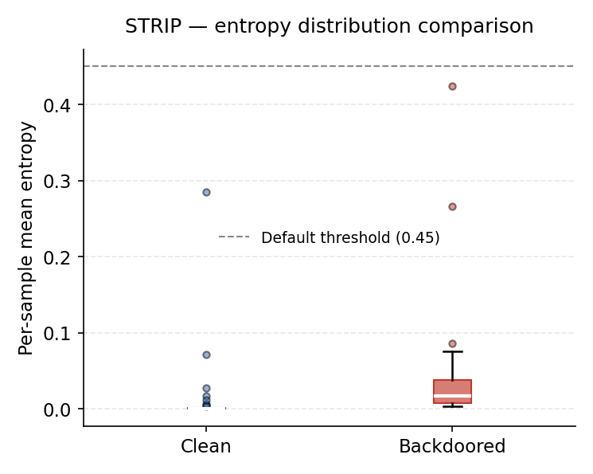
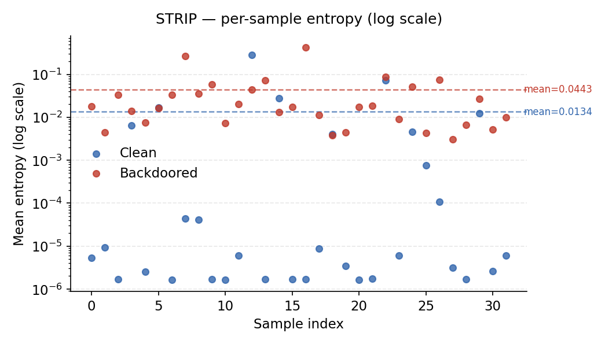

# STRIP Defense — Mithridatium

## Overview

STRIP (STRong Intentional Perturbation) is a runtime backdoor detection method that evaluates how model predictions change when inputs are mixed with random images. In this implementation, a backdoored model tends to produce higher-entropy (more uncertain) predictions on perturbed inputs compared to a clean model, because the trigger signal is diluted by mixing.

Note: this behavior is specific to this implementation. The original STRIP paper uses the inverse intuition — that backdoored models remain confident under perturbation because the trigger dominates. The threshold and interpretation here are calibrated to the observable behavior in practice, where backdoored models show elevated entropy variance.

## Method

For each base image, STRIP generates perturbed samples by mixing it with other images and measures prediction entropy:

1. Sample base images from the test dataset.
2. For each base image, generate perturbed inputs via linear mixing:

   ```
   x_mix = 0.5 * x_base + 0.5 * x_random
   ```

3. Run the model on each perturbed input and compute prediction entropy:

   ```
   p = softmax(logits) + 1e-8
   H(p) = -sum(p * log(p))
   ```

4. Average entropy across all perturbations for each base sample.
5. Compute summary statistics across all base samples.
6. Compare mean entropy against a configurable threshold.

## Key Outputs

| Field                               | Description                                |
| ----------------------------------- | ------------------------------------------ |
| `entropies`                         | Per-base-sample mean entropy values        |
| `statistics.entropy_mean`           | Mean entropy across all base samples       |
| `statistics.entropy_std`            | Standard deviation of per-sample entropies |
| `statistics.entropy_min`            | Minimum per-sample mean entropy            |
| `statistics.entropy_max`            | Maximum per-sample mean entropy            |
| `verdict`                           | `"likely clean"` or `"likely backdoored"`  |
| `thresholds.entropy_mean_threshold` | Decision threshold (default: 0.45)         |

## CLI Usage

Base command:

```bash
mithridatium detect \
  --model models/resnet18.pth \
  --data cifar10 \
  --defense strip \
  --out reports/strip.json
```

Hugging Face provider:

```bash
mithridatium detect \
  --provider huggingface \
  --hf-model-id microsoft/resnet-50 \
  --data cifar10_for_imagenet \
  --defense strip \
  --out reports/strip.json
```

## CLI Parameters

| Flag             | Description                                                    |
| ---------------- | -------------------------------------------------------------- |
| `--model, -m`    | Path to model checkpoint (.pth)                                |
| `--provider, -p` | `torchvision` or `huggingface`                                 |
| `--hf-model-id`  | Hugging Face model ID (required when `--provider huggingface`) |
| `--data, -d`     | Dataset name (e.g., `cifar10`)                                 |
| `--defense, -D`  | Must be `strip`                                                |
| `--arch, -a`     | Architecture hint (used for model validation)                  |
| `--out, -o`      | Output JSON path; use `-` for stdout                           |
| `--force, -f`    | Overwrite existing output file                                 |

STRIP does not expose tunable parameters via the CLI. Internal defaults are:

```
num_bases               = 32
num_perturbations       = 16
entropy_mean_threshold  = 0.45
```

These can be modified when calling directly via Python. The CLI invokes:

```python
results = strip_scores(model, config)
```

## Python Usage

```python
from mithridatium.defenses.strip import strip_scores
from mithridatium import utils

model = ...
config = utils.get_preprocess_config("cifar10")

results = strip_scores(
    model,
    config,
    num_bases=32,
    num_perturbations=16,
    entropy_mean_threshold=0.45,
    seed=42
)
```

## Output Format

```json
{
  "defense": "strip",
  "entropies": [float, ...],
  "statistics": {
    "entropy_mean": float,
    "entropy_min": float,
    "entropy_max": float,
    "entropy_std": float
  },
  "parameters": {
    "num_bases": int,
    "num_perturbations": int,
    "seed": int | null
  },
  "dataset": "cifar10",
  "verdict": "likely clean | likely backdoored",
  "thresholds": {
    "entropy_mean_threshold": float
  }
}
```

## Interpretation

- `entropy_mean > threshold` → `"likely backdoored"`
- `entropy_mean <= threshold` → `"likely clean"`

Entropy distribution shape and standard deviation provide additional signal beyond the mean alone. A model with a higher spread in per-sample entropies (larger `entropy_std`) and elevated `entropy_mean` is more suspicious, even when both values remain below the threshold.

## Example Results

Clean model (`resnet18_cifar10.pt`):

```
entropy_mean:  0.0134   → very low, near-zero on most samples
entropy_std:   0.0505
entropy_max:   0.285    → one outlier sample
verdict:       likely clean
```

Backdoored model (`resnet18_bd.pth`):

```
entropy_mean:  0.0443   → elevated vs. clean
entropy_std:   0.0832   → higher variance
entropy_max:   0.424    → one outlier near threshold
verdict:       likely clean  (threshold not exceeded)
```

Both models are classified as "likely clean" under the default threshold of 0.45. The distributions are meaningfully different — the backdoored model shows roughly 3x higher mean entropy and 65% higher standard deviation — but neither crosses the threshold. This indicates the default threshold requires calibration for this dataset and model family. Consider reducing `entropy_mean_threshold` to approximately 0.03–0.05 when working with CIFAR-10 ResNet-18 models, or treating `entropy_std` as a secondary signal.

## Limitations

- The default threshold (0.45) is not calibrated for all datasets and architectures. It should be tuned empirically on known clean and backdoored models.
- STRIP requires access to a representative test dataset for both base images and perturbation sources.
- Results vary across runs unless `seed` is set, because base and perturbation samples are drawn randomly.
- Does not identify trigger location, target class, or attack type.
- Sensitive to preprocessing alignment: the dataset passed via `--data` must match the normalization the model was trained with.

## Summary

STRIP detects backdoors by measuring prediction entropy under random input mixing. It requires only forward passes, making it fast and compatible with black-box model access. Interpretation should consider the full entropy distribution — shape, variance, and maximum — rather than relying solely on mean entropy against a fixed threshold.

## Graphs

**Entropy distribution comparison** — box plots for clean vs backdoored, with the default threshold marked. Shows median, spread, and outliers at a glance. Both models fall below the default threshold of 0.45, illustrating the calibration issue described above.



**Per-sample entropy (log scale)** — every base sample plotted individually. The clean model concentrates near zero on most samples; the backdoored model has a higher floor and wider spread across the board. Dashed lines mark the per-model mean.


